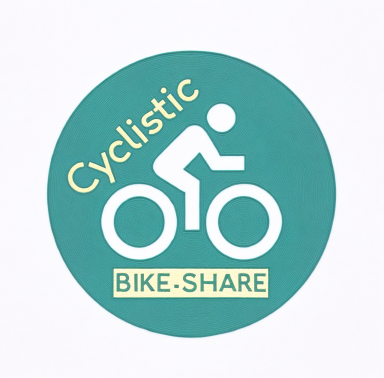

<head>
    

<head>
 
</head>
<body>

<a href="cyclistic_case.html" class="blog-card">

<h3>Cyclistic Case Study</h3>

How does a bike-share navigate speedy success? Read more...

</a>

</body>
</html>